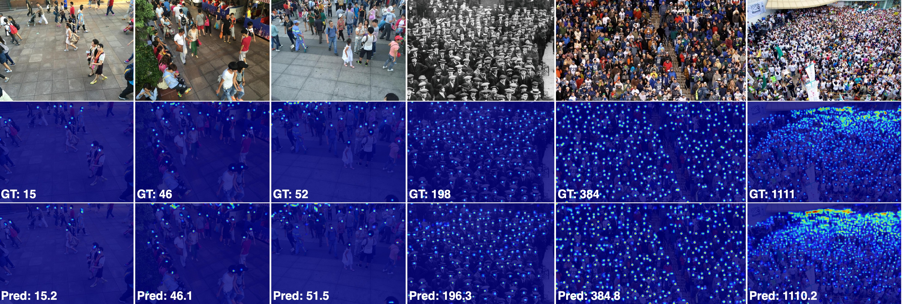

# 🚀 CLIP-EBC 

[](https://paperswithcode.com/sota/crowd-counting-on-ucf-qnrf?p=clip-ebc-clip-can-count-accurately-through)
[](https://paperswithcode.com/sota/crowd-counting-on-shanghaitech-a?p=clip-ebc-clip-can-count-accurately-through)
[](https://paperswithcode.com/sota/crowd-counting-on-shanghaitech-b?p=clip-ebc-clip-can-count-accurately-through)
[](https://paperswithcode.com/sota/crowd-counting-on-nwpu-crowd-val?p=clip-ebc-clip-can-count-accurately-through)

The official implementation of **CLIP-EBC**, proposed in the paper [*CLIP-EBC: CLIP Can Count Accurately through Enhanced Blockwise Classification*](https://arxiv.org/abs/2403.09281v1). 

At the [release page](https://github.com/Yiming-M/CLIP-EBC/releases), you can find **weights** of the models. For the recent updated CLIP-EBC (ViT-B/16) model, we also provide the **training logs** (both text and tensorboard files).


## Results on NWPU Test

| **Methods**                   | **MAE** | **RMSE** |
| ------------------------------|---------|----------|
| DMCount-EBC (based on VGG-19) | 83.7    | 376.0    |
| [CLIP-EBC (based on ResNet50)](https://www.crowdbenchmark.com/resultdetail.html?rid=149)  | 75.8    | 367.3    |
| [CLIP-EBC (based on ViT-B/16)](https://www.crowdbenchmark.com/resultdetail.html?rid=152) | **61.2**    | **278.3** |

## Visualization




## Citation

If you find this work useful, please consider to cite:

- BibTex:
    ```latex
    @article{ma2024clip,
    title={CLIP-EBC: CLIP Can Count Accurately through Enhanced Blockwise Classification},
    author={Ma, Yiming and Sanchez, Victor and Guha, Tanaya},
    journal={arXiv preprint arXiv:2403.09281},
    year={2024}
    }
    ```
- MLA: Ma, Yiming, Victor Sanchez, and Tanaya Guha. "CLIP-EBC: CLIP Can Count Accurately through Enhanced Blockwise Classification." arXiv preprint arXiv:2403.09281 (2024).
- APA: Ma, Y., Sanchez, V., & Guha, T. (2024). CLIP-EBC: CLIP Can Count Accurately through Enhanced Blockwise Classification. arXiv preprint arXiv:2403.09281.


## Usage

### 1. Preprocessing

#### 1.0 Requirements

```bash
conda create -n clip_ebc python=3.12.4  # Create a new conda environment. You may use `mamba` instead of `conda` to speed up the installation.
conda activate clip_ebc  # Activate the environment.
pip install -r requirements.txt  # Install the required packages.
```

#### 1.1 Downloading the datasets

Download all datasets and unzipped them into the folder `data`.

- ShanghaiTech: https://www.kaggle.com/datasets/tthien/shanghaitech/data
- UCF-QNRF: https://www.crcv.ucf.edu/data/ucf-qnrf/
- NWPU-Crowd: https://www.crowdbenchmark.com/nwpucrowd.html

The `data` folder should look like:
```
data:
├─── ShanghaiTech
│   ├── part_A
│   │   ├── train_data
│   │   │   ├── images
│   │   │   └── ground-truth
│   │   └── test_data
│   │       ├── images
│   │       └── ground-truth
│   └── part_B
│       ├── train_data
│       │   ├── images
│       │   └── ground-truth
│       └── test_data
│           ├── images
│           └── ground-truth
├─── NWPU-Crowd
│   ├── images_part1
│   ├── images_part2
│   ├── images_part3
│   ├── images_part4
│   ├── images_part5
│   ├── mats
│   ├── train.txt
│   ├── val.txt
│   └── test.txt
└─── UCF-QNRF
    ├── Train
    └── Test
```

#### 1.2 Running the preprocessing script

Then, run `bash preprocess.sh` to preprocess the datasets. In this script, do NOT modify the `--dst_dir` argument, as the pre-defined paths are used in other files.

### 2. Training

To train a model, use `trainer.py`. Below is the script that we used. You can modify the script to train on different datasets and models.

```bash
#!/bin/sh
export CUDA_VISIBLE_DEVICES=0  # Set the GPU ID. Comment this line to use all available GPUs.

### Some notes:
# 1. The training script will automatically use all available GPUs in the DDP mode.
# 2. You can use the `--amp` argument to enable automatic mixed precision training to speed up the training process. Could be useful for UCF-QNRF and NWPU.
# 3. Valid values for `--dataset` are `nwpu`, `sha`, `shb`, and `qnrf`.
# See the `trainer.py` for more details.

# Train the commonly used VGG19-based encoder-decoder model on NWPU-Crowd.
python trainer.py \
    --model vgg19_ae --input_size 448 --reduction 8 --truncation 4 --anchor_points average \
    --dataset nwpu \
    --count_loss dmcount &&

# Train the CLIP-EBC (ResNet50) model on ShanghaiTech A. Use `--dataset shb` if you want to train on ShanghaiTech B.
python trainer.py \
    --model clip_resnet50 --input_size 448 --reduction 8 --truncation 4 --anchor_points average --prompt_type word \
    --dataset sha \
    --count_loss dmcount &&

# Train the CLIP-EBC (ViT-B/16) model on UCF-QNRF, using VPT in training and sliding window prediction in testing.
# By default, 32 tokens for each layer are used in VPT. You can also set `--num_vpt` to change the number of tokens.
# By default, the deep visual prompt tuning is used. You can set `--shallow_vpt` to use the shallow visual prompt tuning.
python trainer.py \
    --model clip_vit_b_16 --input_size 224 --reduction 8 --truncation 4 \
    --dataset qnrf --batch_size 16 --amp \
    --num_crops 2 --sliding_window --window_size 224 --stride 224 --warmup_lr 1e-3 \
    --count_loss dmcount
```

#### Some Tips

- **DDP**: If you don't limit the number of devices, then all GPUs will be used and the code will run in a ddp style.
- **AMP**: Simply provide the `--amp` argument to enable automatic mixed precision training. This could significantly speed up the training on UCF-QNRF and NWPU.

#### All available models

- CLIP-based: `clip_resnet50`, `clip_resnet50x4`, `clip_resnet50x16`, `clip_resnet50x64`, `clip_resnet101`, `clip_vit_b_16`, `clip_vit_b_32`, `vit_l_14`.
- Encoder-Decoder: 
  - `vgg11_ae`, `vgg11_bn_ae`, `vgg13_ae`, `vgg13_bn_ae`, `vgg16_ae`, `vgg16_bn_ae`, `vgg19_ae` (the model used in [DMCount](https://github.com/cvlab-stonybrook/DM-Count) & [BL](https://github.com/ZhihengCV/Bayesian-Crowd-Counting)), `vgg19_bn_ae`;
  - `resnet18_ae`, `resnet34_ae`, `resnet50_ae`, `resnet101_ae`, `resnet152_ae`;
  - `csrnet`, `csrnet_bn`;
  - `cannet`, `cannet_bn`.
- Encoder:
  - `vit_b_16`, `vit_b_32`, `vit_l_16`, `vit_l_32`, `vit_h_14`;
  - `vgg11`, `vgg11_bn`, `vgg13`, `vgg13_bn`, `vgg16`, `vgg16_bn`, `vgg19`, `vgg19_bn`;
  - All `timm` models that support `features_only`, `out_indices` and contain the `feature_info` attribute.

#### Arguments in `trainer.py`

##### Arguments for models

- `model`: which model to train. See all available models above.
- `input_size`: the crop size during training.
- `reduction`: the reduction factor of the model. This controls the size of the output probability/density map.
- `regression`: use blockwise regression instead of classification.
- `truncation`: parameter controlling label correction. Currently supported values:
    - `configs/reduction_8.json`: 2 (all datasets), 4 (all datasets), 11 (only UCF-QNRF).
    - `configs/reduction_16.json`: 16 (only UCF-QNRF).
    - `configs/reduction_19.json`: 19 (only UCF-QNRF).
- `anchor_points`: the representative count values in the paper. Set `average` to use the mean count value of the bin. Set `middle` to use the middle point of the bin.
- `granularity`: the granularity of the bins. Choose from `"fine"`, `"dynamic"`, `"coarse"`.

###### Arguments for CLIP-based models

- `prompt_type`: how to represent the count value in the prompt (e.g., if `"word"`, then a prompt could be `"There are five people"`). Only supported for CLIP-based models.
- `num_vpt`: the number of visual prompt tokens. Only supported for ViT-based CLIP-EBC models.
- `vpt_drop`: the dropout rate for the visual prompt tokens. Only supported for ViT-based CLIP-EBC models.
- `shallow_vpt`: use shallow visual prompt tuning or not. Only supported for ViT-based CLIP-EBC models. The default version is the deep visual prompt tuning.

##### Arguments for data

- `dataset`: which dataset to train on. Choose from `"sha"`, `"shb"`, `"nwpu"`, `"qnrf"`.
- `batch_size`: the batch size for training.
- `num_crops`: the number of crops generated from each image.
- `min_scale` & `max_scale`: the range of the scale augmentation. We first randomly generate a scale factor from `[min_scale, max_scale]`, then crop the image of the size `input_size * scale` and then resize it to `input_size`. This augmentation is used to increase the sample size for large local count values.
- `brightness`, `contrast`, `saturation` & `hue`: the parameters for the color jittering augmentation. Note that `hue` is set to `0.0` by default, as we found using positive values leads to `NaN` DMCount loss.
- `kernel_size`: The kernel size of the Gaussian blur of the cropped image.
- `saltiness` & `spiciness`: parameters for the salt-and-pepper noise augmentation.
- `jitter_prob`, `blur_prob`, `noise_prob`: the probabilities of the jittering, Gaussian blur, and salt-and-pepper noise augmentations.

##### Arguments for evaluation

- `sliding_window`: use the sliding window prediction method or not in evaluation. Could be useful for transformer-based models.
- `window_size`: the size of the sliding window.
- `stride`: the stride of the sliding window.
- `strategy`: how to handle overlapping regions. Choose from `"average"` and `"max"`.
- `resize_to_multiple`: resize the image to the nearest multiple of `window_size` before sliding window prediction.
- `zero_pad_to_multiple`: zero-pad the image to the nearest multiple of `window_size` before sliding window prediction.

**Note**: When using sliding window prediction, if the image size is not a multiple of the window size, then the last stride will be smaller than `stride` to produce a complete window.

##### Arguments for training

- `weight_count_loss`: the weight of the count loss (e.g. DMCount loss) in the total loss.
- `count_loss`: the count loss to use. Choose from `"dmcount"`, `"mae"`, `"mse"`.
- `lr`: the maximum learning rate, default to `1e-4`.
- `weight_decay`: the weight decay, default to `1e-4`.
- `warmup_lr`: the learning rate for the warm-up period, default to `1e-6`.
- `warmup_epochs`: the number of warm-up steps, default to `50`.
- `T_0`, `T_mult`, `eta_min`: the parameters for `CosineAnnealingWarmRestarts` scheduler. The learning rate will increase from `warmup_lr` to `lr` during the first `warmup_epochs` epochs, then adjusted by the cosine annealing schedule.
- `total_epochs`: the total number of epochs to train.
- `eval_start`: the epoch to start evaluation.
- `eval_freq`: the frequency of evaluation.
- `save_freq`: the frequency of saving the model. Could be useful to reduce I/O.
- `save_best_k`: save the best `k` models based on the evaluation metric.
- `amp`: use automatic mixed precision training or not.
- `num_workers`: the number of workers for data loading.
- `local_rank`: do not set this argument. It is used for multi-GPU training.
- `seed`: the random seed, default to `42`.

### 3. Testing on NWPU Test

To evaluate get the result on NWPU Test, use the `test_nwpu.py` instead.

```bash
# Test CNN-based models
python test_nwpu.py \
    --model vgg19_ae --input_size 448 --reduction 8 --truncation 4 --anchor_points average \
    --weight_path ./checkpoints/nwpu/vgg19_ae_448_8_4_fine_1.0_dmcount_aug/best_mae.pth
    --device cuda:0 &&

# Test ViT-based models. Need to use the sliding window prediction method.
python test_nwpu.py \
    --model clip_vit_b_16 --input_size 224 --reduction 8 --truncation 4 --anchor_points average --prompt_type word \
    --num_vpt 32 --vpt_drop 0.0 --sliding_window --stride 224 \
    --weight_path ./checkpoints/nwpu/clip_vit_b_16_word_224_8_4_fine_1.0_dmcount/best_rmse.pth
    --device cuda:0
```

### 4. Visualization

Use the `model.ipynb` notebook to visualize the model predictions.
